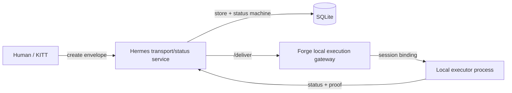
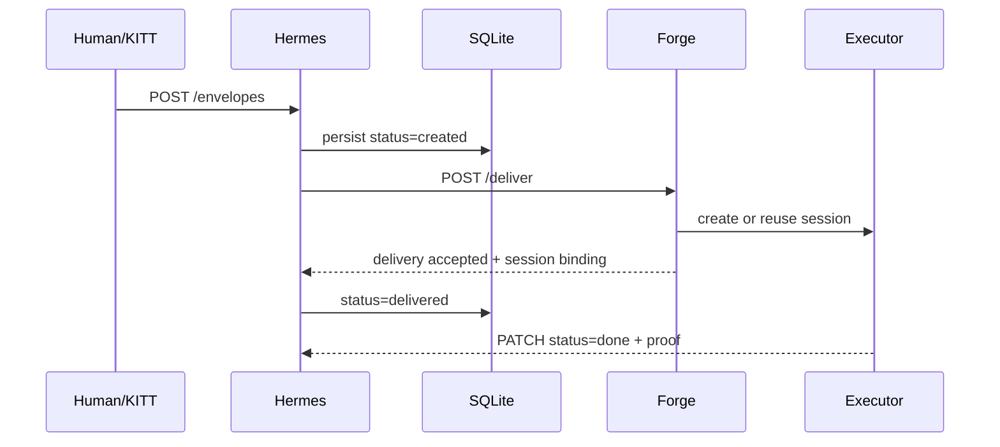

# Hermes / Forge

**typed Go transport/status service + local execution gateway for reliable human/agent task handoff.**

Hermes / Forge is a public, sanitized snapshot of a working Go system for moving delegated work from a human-facing control plane to a local execution gateway without losing state, status, or proof. It is intentionally small enough to review, but complete enough to demonstrate API design, SQLite-backed state machines, local gateway orchestration, and end-to-end tests.

## Why it exists

Human/agent workflows fail when work disappears between “please do this” and “it is done.” Chat history is not a delivery system, and optimistic status messages are not proof. Hermes / Forge treats delegated work as an envelope with explicit status transitions, durable storage, and a delivery contract.

## What is in this snapshot

- **Hermes** — Go HTTP/MCP-facing transport and status service.
- **Forge** — Go local execution gateway that receives deliveries and binds them to executor sessions.
- **SQLite persistence** — durable envelope/session state with tests around status behavior.
- **E2E proof** — in-process tests prove envelope creation, delivery, session I/O, and final proof.
- **Public sanitization** — no private infrastructure, secrets, production URLs, logs, databases, or personal paths.

## Architecture at a glance



The main demo path is:



## Repository layout

```text
hermes/       Go module: transport/status service
forge/        Go module: local execution gateway
test/e2e/     Go module: in-process end-to-end tests
examples/     Sanitized sample envelope payloads
docs/         Architecture, demo, security, decisions, mirror process
```

## Quick start

Prerequisite: Go 1.26 or newer.

```bash
make test
```

Or run modules individually:

```bash
cd hermes && go test ./...
cd forge && go test ./...
cd test/e2e && go test ./...
```

For local experiments, use placeholder values only:

```bash
export HERMES_KEY=replace-with-local-development-key
export HERMES_URL=http://127.0.0.1:8081
export FORGE_URL=http://127.0.0.1:8090
```

See [`docs/DEMO.md`](docs/DEMO.md) for a safe local demo flow.

## Technical highlights

- **Typed Go boundaries:** separate modules for service, gateway, and E2E proof.
- **Explicit envelope contract:** status values are documented in [`ENVELOPE-SPEC.md`](ENVELOPE-SPEC.md).
- **SQLite state machine:** deterministic persistence for envelopes, sessions, notifications, and keys.
- **Transport/execution split:** Hermes does not execute tasks; Forge owns local execution binding.
- **Operations mindset:** health checks, graceful shutdown paths, Makefile targets, and CI-ready tests.
- **Security posture:** public-safe placeholders, API-key header model, private runbooks excluded.

## Limitations of the public snapshot

- This is a sanitized mirror, not the private operations repository.
- Private deployment manifests, real keys, production URLs, logs, and databases are intentionally absent.
- The public demo focuses on local/in-process verification rather than private infrastructure.

## Next improvements

- Expand OpenAPI-style API documentation.
- Add a guided local demo script that seeds a development key without private assumptions.
- Improve dashboard screenshots with synthetic public data.
- Add release artifacts once the public interface stabilizes.

## More documentation

- [`docs/ARCHITECTURE.md`](docs/ARCHITECTURE.md)
- [`docs/DEMO.md`](docs/DEMO.md)
- [`docs/SECURITY_MODEL.md`](docs/SECURITY_MODEL.md)
- [`docs/DESIGN_DECISIONS.md`](docs/DESIGN_DECISIONS.md)
- [`docs/PUBLIC_MIRROR_PROCESS.md`](docs/PUBLIC_MIRROR_PROCESS.md)

## License

MIT. See [`LICENSE`](LICENSE).
