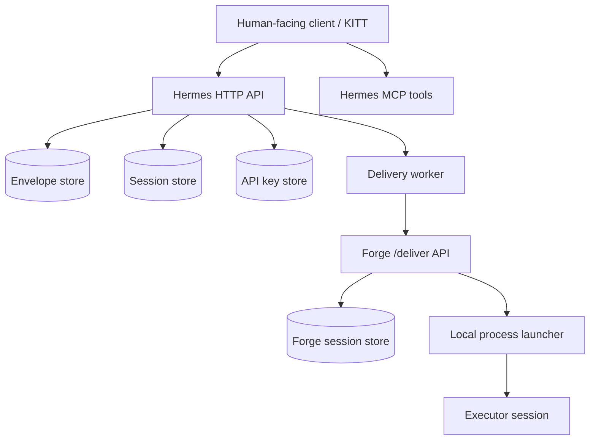

# Architecture

Hermes / Forge separates deterministic transport from local execution.

## Components

## Core flow

1. A client creates an envelope with a target executor and task goal.
2. Hermes persists it as the source of truth.
3. Hermes delivery worker POSTs the envelope to Forge using the `/deliver` wire contract.
4. Forge creates or reuses a local session and returns the binding.
5. Hermes records `delivered` and later accepts truthful status transitions with proof.

## State model

Envelopes use an explicit status vocabulary: `created`, `delivered`, `read`, `in_progress`, `paused`, `blocked`, `awaiting_confirm`, `done`, `failed`, and `lost`. The goal is not to infer progress from logs; the system records stated transitions and proof.

## Module boundaries

- `hermes/` owns envelope storage, status APIs, delivery routing, activity, notification, key, and project/session views.
- `forge/` owns local delivery handling, session persistence, executor launch, session input/output, and notification/resume hooks.
- `test/e2e/` proves the cross-module walking skeleton in process, avoiding private services.

## Design constraints

- Hermes is a transport/status authority, not an executor.
- Forge is stateful on the local machine and must not assume private deployment details.
- Tests must be able to run on a clean public checkout.
- Public docs and examples must use placeholders only.
