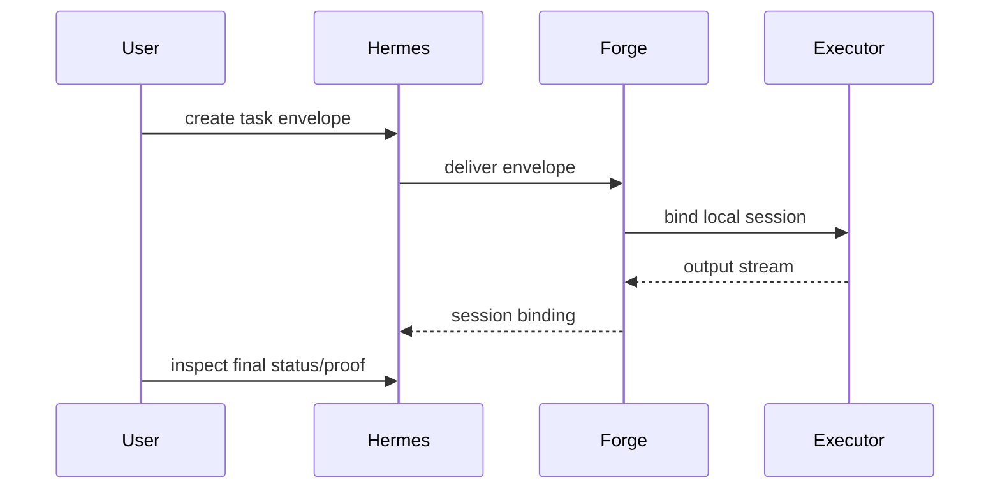

# Local Demo

This public snapshot is designed to be demonstrated without private infrastructure.

## Fast proof: tests

```bash
make test
```

The strongest demo is the E2E test module:

```bash
cd test/e2e && go test ./...
```

It exercises the walking skeleton: envelope creation, Hermes delivery, Forge session binding, session I/O, and final `done` status with proof.

## Manual local shape

Use only placeholder development values:

```bash
export HERMES_KEY=replace-with-local-development-key
export HERMES_URL=http://127.0.0.1:8081
export FORGE_URL=http://127.0.0.1:8090
```

Start Forge in one terminal:

```bash
cd forge
FORGE_ADDR=127.0.0.1:8090 \
HERMES_URL=http://127.0.0.1:8081 \
HERMES_KEY=replace-with-local-development-key \
go run ./cmd/forge
```

Start Hermes in another terminal:

```bash
cd hermes
HERMES_ADDR=127.0.0.1:8081 \
FORGE_URL=http://127.0.0.1:8090 \
go run ./cmd/hermes
```

Health checks:

```bash
curl -fsS http://127.0.0.1:8081/healthz
curl -fsS http://127.0.0.1:8090/healthz
```

## Demo sequence



## Notes

- The public snapshot intentionally does not include private bootstrap keys or production deployment steps.
- For repeatable employer review, prefer `make test` and the E2E module over private environment assumptions.
- Do not replace placeholders with real secrets in the repository.
